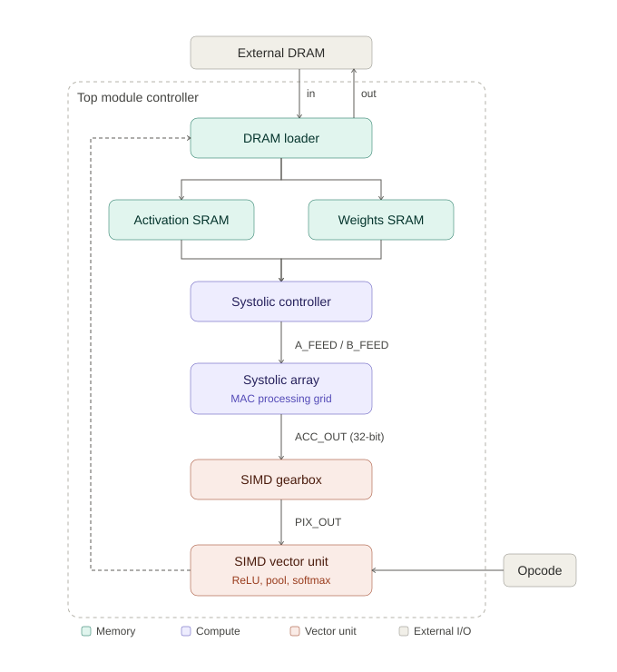

# Systolic Array NPU — ASIC Accelerator for Edge CNN Inference

A custom hardware accelerator for running CNN inference efficiently on edge devices, built from scratch in SystemVerilog and taken through ASIC synthesis with Cadence Genus.

The core idea: instead of relying on power-hungry GPUs (which don't fit the power/area budget of edge devices), this project designs a domain-specific chip that speeds up convolutions using a systolic array, while keeping data movement — the real bottleneck in most accelerators — to a minimum.

## Why this project

AI is moving from the cloud to the edge, but the hardware that runs it hasn't fully caught up — GPUs are too big and power-hungry for constrained devices, and generic CPUs are too slow. This project explores what a purpose-built chip for CNN inference could look like, from the compute core all the way through to physical synthesis.

## How it works

The accelerator turns convolution into matrix multiplication (using an Im2Col transform done directly in hardware, not in software) and feeds it through a 2D grid of Multiply-Accumulate units that pass data between neighbors instead of constantly re-reading memory. Everything else a CNN needs — activations, pooling, quantization, softmax — runs through one reconfigurable vector unit that's told what to do via a simple opcode, instead of building separate hardware for every operation.



Data enters from external DRAM into the **DRAM loader**, which splits it into an **activation SRAM** and a **weights SRAM**. The **systolic controller** feeds both into the **systolic array** as `A_FEED`/`B_FEED`. The array's 32-bit partial sums (`ACC_OUT`) pass through the **SIMD gearbox** (`PIX_OUT`), into the **SIMD vector unit**, where a 4-bit **opcode** selects ReLU, pooling, quantization, or softmax. The final result (`LAYER_OUT`) loops back to the DRAM loader for write-back to memory.

## Key design pieces

- **Systolic array compute core** — a grid of MAC processing elements that stream data to their neighbors, so each weight/activation is fetched from memory once and reused many times.
- **Hardware Im2Col engine** — converts convolution's sliding windows into GEMM-friendly matrices on the fly, including zero-padding and striding handled purely through address math (no wasted memory or cycles on padding).
- **Matrix tiling with edge-case handling** — layers bigger than the physical array are automatically split into tiles, with "line clamping" logic to safely zero out unused lanes at unaligned boundaries.
- **One reconfigurable SIMD unit** instead of many fixed blocks — an opcode picks between:
  - branchless ReLU (just a sign-bit check)
  - single-cycle max pooling (comparator tree, no sequential stalls)
  - global average pooling
  - INT8 quantization with saturation
  - a hardware softmax (LUT + Taylor series + Newton-Raphson reciprocal)
- **Adaptive SIMD gearbox** — repacks or splits pixel streams depending on how many channels a layer has, so the vector lanes stay busy whether a layer is 3 channels or 300.
- **Fused bias and batch norm** — bias and BatchNorm math get folded into the weights/MAC computation ahead of time, so there's no dedicated hardware (and no division or square roots) needed at inference time.
- **Bit-exact verification** — a Python/NumPy golden model mirrors the hardware's exact fixed-point math, and an automated testbench compares hardware output against it pixel-by-pixel.

## Development process

1. Designed the systolic array and MAC processing elements in SystemVerilog.
2. Built the DRAM loader to handle Im2Col, padding, and striding in hardware.
3. Designed the SIMD gearbox and vector unit for activations, pooling, and quantization.
4. Added FSM-based control and operator fusion to avoid unnecessary DRAM round-trips between layers.
5. Built a Python golden-reference model and an automated co-simulation loop to verify hardware output bit-for-bit.
6. Synthesized the final RTL through Cadence Genus to get real area, timing, and power numbers.

## Results so far

**Phase 1 — FPGA prototype (functional validation):**
Tested end-to-end on a small dense network against Fashion-MNIST.

| Metric | Value |
|---|---|
| Clock frequency | 100 MHz |
| Inference latency | ~118 ms/image |
| Throughput | ~8.4 inferences/sec |
| Total on-chip power | 0.864 W |

Correctly classified a test image as "Sandal" (Fashion-MNIST class 5), confirming end-to-end functional correctness.

**Phase 2 — ASIC synthesis (Cadence Genus):**
Migrated the compute core to the systolic array design and ran it through ASIC synthesis to extract gate count, max clock frequency, and power.

*(Add your final area/Fmax/power numbers here once you've got them finalized.)*

## Tech stack

- **RTL:** SystemVerilog
- **Verification:** Python (NumPy), ModelSim/QuestaSim
- **FPGA prototyping:** Xilinx Vivado
- **ASIC synthesis:** Cadence Genus

## Repo structure

```
.
├── AIAccelerator/        # Top-level accelerator integration
├── SIMD/                 # SIMD vector unit (ReLU, pooling, quantization, softmax)
├── systolicArray/        # Systolic array RTL, SRAM wrapper, and testbenches
└── hardware_accelerator/ # Python controller scripts (model extraction, co-sim, comparison)
```

> Feel free to add short notes here on what's inside each folder (e.g. which file is the top module, which script generates the golden reference) so it's easier for someone browsing the repo to know where to start.

## Running it

> Swap these placeholders for your actual file names once you confirm them.

```bash
python hardware_accelerator/extract_model.py --model model.h5   # generates weight/bias/img text files
vsim -do systolicArray/run_sim.do                                # runs the hardware simulation
python hardware_accelerator/compare_outputs.py hw_out.txt golden_out.txt   # verifies bit-exact match
```

## What's next

- Add more activation functions (Leaky ReLU, GELU, sigmoid) to the SIMD unit
- Explore multi-port or bank-interleaved SRAM for better memory throughput
- Add a small on-chip scratchpad/cache to cut down DRAM traffic further
- Dynamic voltage/frequency scaling for better power efficiency
- Scale up to multiple systolic arrays running in parallel

## Author

Built by **Shivani S** as a final year engineering project.

## License

*(Add a license here — MIT is a common choice for portfolio/academic projects — if you want this open source.)*
